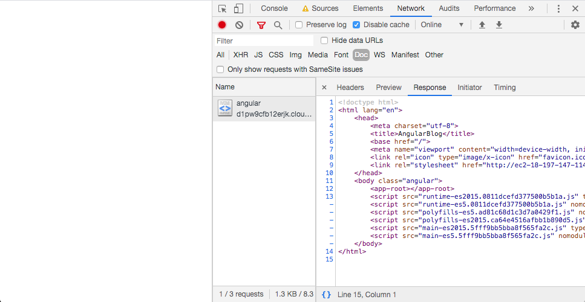
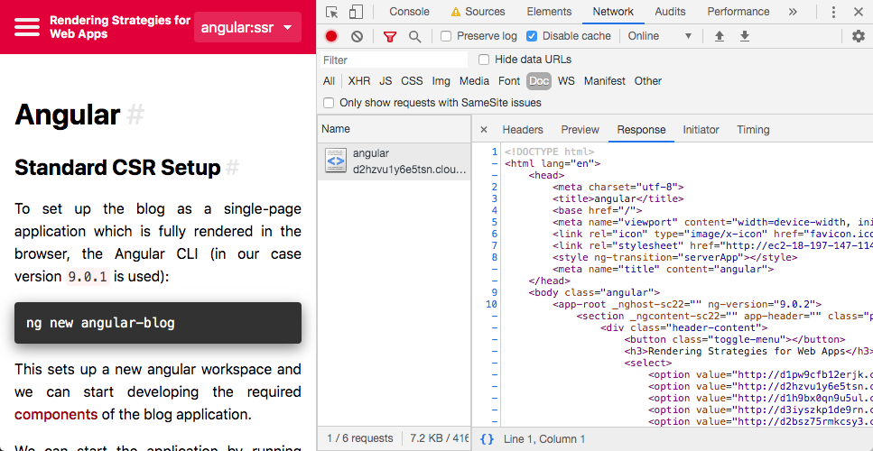

# Angular

## Standard CSR Setup

To set up the blog as a single-page application which is fully rendered in the browser, the Angular CLI (in our case version `9.0.1` is used):

```shell
ng new angular-blog
```

This sets up a new angular workspace and we can start developing the required [components](./case-study#frontend) of the blog application.
 
We can start the application by running `ng serve` and visit our browser on `http://localhost:4200`
However if we visit the app with a browser with no JavaScript, we end up with a blank screen.
That is because the payload of the HTML file provided by the server contains no real content:

<p class="image">

Angular CSR App visited with JavaScript disabled 
</p>


When the first version of the angular application was ready, its source code was in [this state](https://github.com/glutengo/rendering-strategies/tree/angular-csr/angular-blog).

## Adding SSR Features

The Angular Website provides a very helpful [guide](https://angular.io/guide/universal) to set up server-side rendering for Angular applications which proved good reference for this case study.

To add SSR behavior to an Angular app, we need to add [Angular Universal](https://github.com/angular/universal) to our project. 
The required steps can be performed by adding the corresponding schematic:

```ng add @nguniversal/express-engine```

This adds an additional module for our new server renderer application (`app.server.module.ts`). 
This module is used the also scaffolded server entry point script (`server.ts`). 
This file sets up an [express.js](https://expressjs.com/) based server which uses our Angular app as its [view engine](https://expressjs.com/en/guide/using-template-engines.html).

We are also provided with a number of helpful scripts in the package.json file which allow us to start a development server with hot-reloading and compilation on save (`dev:ssr`), create a production build (`build:ssr`), serve the previously built server application (`serve:ssr`) or create a prerendered version of the pages with fixed routes.   

```json
"scripts": {
    ...
    "dev:ssr": "ng run angular-blog:serve-ssr",
    "serve:ssr": "node dist/angular-blog/server/main.js",
    "build:ssr": "ng build --prod && ng run angular-blog:server:production",
    "prerender": "ng run angular-blog:prerender",
    ...
  }
```

We can now run the server-side rendered application in development mode using `npm run dev:ssr`. 
The application can now be visited on the same URL as mentioned above (or port 4201 in case the other process is still running).
Visiting it with a browser with no JavaScript still lets us access the content.

The payload of the first HTML file provided by the server already contains all real content and meaningful, content related meta tags:

<p class="image">

Angular SSR App visited with JavaScript disabled 
</p>

The [changes required to achieve this](https://github.com/glutengo/rendering-strategies/commit/e2075e741b3ba381c148287d07ae57a72fb7d07f) are minimal and were primary handled by the Angular CLI.

### Universal JavaScript

In the current setup, we are using universal JavaScript to run the same application on the server that we are running in the browser.
This is comfortable because we do not need to rewrite anything. However we do need to be careful at some points. 
Some global browser variables that we may be used to rely on are not available when running the same code on a NodeJS server instead of a browser.
The `document` and the `window` object are examples of these. 
We may still want to use these objects in our browser app und not wrap every access in a if statement to keep our code clean.
Angular's solution for this problem is its [dependency injection](https://angular.io/guide/dependency-injection) system.

```typescript
import { DOCUMENT } from '@angular/common';
...
constructor(@Inject(DOCUMENT) private document: Document) {...}
``` 

Instead of relying on the global objects, we let Angular decide which version of the object to use. 
When we are in the browser, Angular provides the e.g. the well-known Standard DOM `document` Object.
When the application is run on the server, Angular provides another implementation which supports the same API, but different implementations for some methods.
By this means we can still use the API without breaking the app when running on the server.

### Prerender

As an alternative to Universal JavaScript, we are also provided with the option to use Prerendering instead. 
In this case, we do not actually run the application on the server. 
Instead we build the application once and store the result. 
We end up with one or more rich HTML files which can be served by a static file server.

It is notable that Angular does not use a headless browser to render the pages but still relies on its universal engine.
While prerendering usually allows using browser-only JavaScript features like the global `document` object, this does not apply to the Angular prerender task.
We still need to bypass this by using the techniques explained above.

This approach has the advantage that no server side logic is required at runtime. 
Instead, the rendering is performed at build time. 
However this has its own big downside: We need to know which routes exist when performing the prerendering.
The required routes need to be added in the `angular.json` configuration file:

```json
"prerender": {
  "builder": "@nguniversal/builders:prerender",
  "options": {
    "browserTarget": "angular-blog:build:production",
    "serverTarget": "angular-blog:server:production",
    "routes": [
      "/",
      "posts/motivation"
    ]
  },
  "configurations": {
    "production": {}
  }
}
```

This may be sufficient for static websites where the routes are fixed and always known.
If we are in the context of a Content Management System or a simple blog like this one, not all routes are known at build time.      

### Sharing

The sharing previews of social media platforms and search engines depend on meta tags.<sup>[[1]](#ref-1)</sup>. 
Angular offers its [own API](https://angular.io/api/platform-browser/Meta) to handle these meta tags.
 
```typescript
import { Meta } from '@angular/platform-browser';

class AppComponent { 

  constructor(private meta: Meta) {}

  ngOnInit() {
    this.meta.updateTag({ name: 'title', content: this.name });
  }
}

```

This API is not limited for use in server-side rendered apps but regarding the tags' importance for web crawlers (see [Motivation](./motivation)) it is very helpful to improve sharing previews.
A very similar approach can be followed for setting the document title (see [Angular docs](https://angular.io/guide/set-document-title)).

### Avoid duplicated requests

When we observe the network tab of our SSR application in the browser we will see that some data is needlessly fetched in the browser although it is already available and visible.
The content of the current post is an excellent example for this. As we have seen earlier, the full content of our post is available in the HTML file provided by the server because the Angular application was executed on the server and this was the result of server side rendering.
Our application is then executed in the browser again and ouro `PostComponent` again fetches the post contents from the backend. 
This fetches data that we already know and in fact the user is already able to see. It is desirable to avoid these sorts of duplicated requests.

Angular provides a solution for this. 
As described in their docs<sup>[[2]](#ref-2)</sup>, by use of the `TransferHttpCacheModule` (part of the @nguniversal/common package) in the App Module and the `ServerTransferStateModule` in the Server Module, all Requests performed with Angular's HttpClient on the server are stored in a key-value store.
This store is transferred to the client. HttpClient Requests in the browser are then answered by the store if possible.
This way requests that were already performed on the server are not sent from the browser again. Any other requests are performed as usual.

The changes to enable this feature in our applications can be retraced [here](https://github.com/glutengo/rendering-strategies/commit/a45d54472cfb72f5a3ea9b1abfc4bf9773372ea2).

### Observations

* Adding server side rendering to an Angular application is fully supported by the Angular CLI. 
A single CLI command sets up the server and all required build steps for on-demand rendering and pre-rendering.
* There are well documented APIs for dealing with common usecases like `<head>` handling or browser-specific globals
* The setup for preventing duplicated HTTP requests is straightforward and does not require any own implementations.       

<a name="ref-1">[1]</a> [Google on Meta Tags](https://support.google.com/webmasters/answer/79812?hl=en)  
<a name="ref-2">[2]</a> [Angular Universal Docs: TransferHttpCacheModule](https://github.com/angular/universal/blob/master/docs/transfer-http.md)
