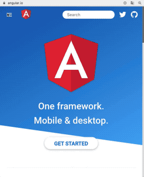
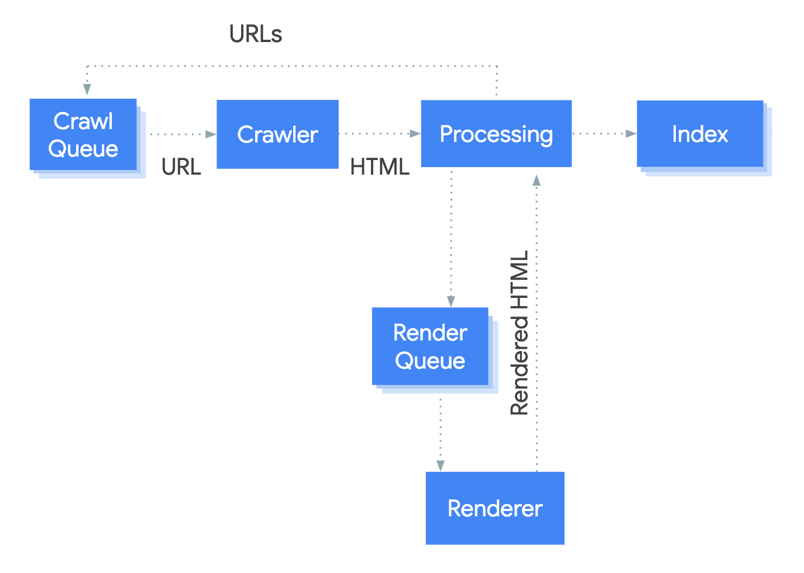

# Motivation

## Web Frameworks

Job descriptions for frontend web developer jobs barely hold great surprises these days and this has been the case for the last few years. 
They very often match in the requirements regarding their applicants' skills in frameworks or pupular libraries for building web applications.
When searching for the term *frontend developer* on job platforms [linkedin.com](https://linkedin.com) and [monster.com](https://monster.com), six out of the ten first listings contained references to [Angular](https://angular.io/), [React](https://reactjs.org/) or both.[[1](#ref-1)][[2](#ref-2)]

Angular and React are both developed by companies which are considered to be leaders in the digital sector. 
Their creators [Facebook](https://facebook.com) and [Google](https://google.com) (represented by parent company Alphabet) both make the top ten of [forbes.com's Top 100 Digital Companies List](https://www.forbes.com/top-digital-companies/list/). 
Considering that these companies created these tools and continue to use them[[3]](#ref-3)[[4]](#ref-4), their quality is considered to be industry proven and many other organisations and developers decided to utilise them as well. 

This has led to a high popularity of these libraries and frameworks among developers worldwide. React is #4 (143 250 Stars) on the list of the highest ranked code repositories on [github](https://github.com), Angular currently ranks on #41 (57 164 Stars) but might have also been among the top 10, had they not chosen to open a new repository in opposition to continuing their work on the repository of predecessor AngularJS (#35, 59 644 Stars). 
Another Web Frontend Framwork with a high position on the list is [Vue.js](https://vuejs.org) (#3, 156 499 Stars).[[5](#ref-5)]
In contrast to React and Facebook, Vue.js was started as a private project by a (now former) Google employee[[6](#ref-6)]. 
[stackoverflow.com](https://stackoverflow.com)'s 2019 developer survey shows that React, Vue.js and Angular are the mosted wanted web frameworks.[[7](#ref-7)]

## Single Page Applications

While all of the introduced frameworks offer support for a number of different use cases, the default setup seems to be tailored for building so-called *single page applications*. 
The React docs list [create-react-app](https://github.com/facebook/create-react-app), a tool for building single page applications with react, as the first of four recommended toolchains.[[8]](#ref-8) 
The Vue.js installation guide introduces its CLI as a tool for "quickly scaffolding ambitious Single Page Applications" [[9]](#ref-9) and Angular docs state that "Angular is an app-design framework and development platform for creating efficient and sophisticated single-page apps" [[10]](#ref-10).

> "A *single page application* is exactily what its name implies: a JavaScript-driven web application that requires only a single page load" [[11]](#ref-11)

The response of the single page requested from the server only contains references to further resources (CSS, Scripts) and a very small amount of markup. 
The actual creation of the HTML tree (*rendering*) is performed in the browser by a script. 
Additional data may be fetched asynchronously by a script as well.[[11]](#ref-11)

### Benefits

An important reason why single page applications have become so popular is their good look and feel.
Once the application is bootstrapped, visiting different sub pages does not require a full page reload. 
Instead, the navigation is performed inside the current page and only the required data is fetched from the server.
This is considered a big advantage as it results in a smooth, app-like user experience once the application has loaded.[[12]](#ref-12)

Single Page Application example: <a href="https://angular.io/">Angular Website</a>

The Angular Website is an example of a such single page application. 
Whilst we are navigating through the application, we are never presented a blank screen, even if the network connection is bad.

### Downsides
The described way of building an application comes with a few downsides. 
The fact that a script is responsible for rendering the markup and fetching the real data makes it a very critical resource. 
If we visit the same page with JavaScript disabled, we are presented with a page offering basically no content and no interactivity.

<a href="https://angular.io/">Angular Website</a> with JavaScript disabled

"Who disables JavaScript in their browser?" or "Who has a browser with no JavaScript in 2020?" one might ask. People usually do not, but robots may. 
A very important robot which may visit your site is the [Googlebot](https://support.google.com/webmasters/answer/182072?hl=en), Google's web crawler. 

Googlebot JavaScript Processing<a href="#ref-13">[13]</a>

The good news is: Googlebot *does* process JavaScript. 
It does work with an evergreen version of Chromium which needs to be considered when selecting the JavaScript language features used in the application. 
But: The JavaScript is not processed on the first visit of the site. Googlebot first just crawls the initial HTML and puts the JavaScript-based rendering (or more general: execution of any JavaScript) into a qeueue which it processes "once Googlebot resources allow" [[13]](#ref-13) it. 
Google does not make definite statements on how long it may take for a queue entry to be processed.[[13]](#ref-13)

When the server answers each initial request with the same static HTML file, there is also no room for optimizing the sharing behavior for inidividual sub pages of the application. Facebook for instance uses the [Open Graph Protocol](https://ogp.me) to generate the sharing previews for their platform. 
There are a number of predefined Meta Tags (e.g. `og:title` and `og:image`) which need to be set for a good sharing performance.[[14]](#ref-14) If these are only defined once, the sharing preview for each sub page (e.g. `/home` and `/about`) will always look the same. 
This leaves the developer with only two options: he could either use very general values which are feasible for all pages or he could use specific values for the page he judges the most important. Both options are not really satisfactory.

At last, single page applications have drawbacks regarding performance.
Although their initial page load may be quick (we will have a look at some more specific [metrics](./metrics) later), the time it takes for the real content to show can be longer because of a higher amount of HTTP roundtrips, especially on mobile devices, where the network conditions may be bad.[[15]](#ref-15)   

Given these disadvantages, we want to have a look at how single page applications are actually rendered.
We will compare the used technique to other alternatives and explore potentials to overcome the usual downsides of single page applications.

   

<a name="ref-1">[1]</a> [monster.com. Job Search on term "frontend developer". visited February 8th 2020](https://www.monster.com/jobs/search/?q=frontend-developer&intcid=skr_navigation_nhpso_searchMain)  
<a name="ref-2">[2]</a> [linkedin.com. Job Search on term "frontend developer". visited February 8th 2020](https://www.linkedin.com/jobs/search?keywords=Frontend%20Developer)  
<a name="ref-3">[3]</a> [opensource.google.com. Angular. visited February 8th 2020](https://opensource.google/projects/angular)  
<a name="ref-4">[4]</a> [Abramov, Dan on twitter.com. 2018. visited February 8th 2020](https://twitter.com/dan_abramov/status/1002590695859933191)  
<a name="ref-5">[5]</a> [gitstar-ranking.com. Repositories Ranking. visited February 8th 2020](https://gitstar-ranking.com/repositories)  
<a name="ref-6">[6]</a> [freecodecamp.org. 2017. Between the Wires: An interview with Vue.js creator Evan You. visited February 8th 2020](https://www.freecodecamp.org/news/between-the-wires-an-interview-with-vue-js-creator-evan-you-e383cbf57cc4/)  
<a name="ref-7">[7]</a> [insights.stackoverflow.com. 2020. Developer Survey Results 2019: Most Wanted Web Frameworks. visited February 8th 2020](https://insights.stackoverflow.com/survey/2019#technology-_-most-loved-dreaded-and-wanted-web-frameworks)  
<a name="ref-8">[8]</a> [reactjs.org. Create a New React App: Recommended Toolchains. visited February 8th 2020](https://reactjs.org/docs/create-a-new-react-app.html#recommended-toolchains)  
<a name="ref-9">[9]</a> [vuejs.org. Installation: CLI. visited February 8th 2020](https://vuejs.org/v2/guide/installation.html#CLI)  
<a name="ref-10">[10]</a> [angular.io. Introduction to the Angular Docs. visited February 8th 2020](https://angular.io/docs#introduction-to-the-angular-docs)  
<a name="ref-11">[11]</a> [Flanagan, David. 2006. JavaScript The Definite Guide. Page 497](https://books.google.de/books?id=2weL0iAfrEMC)  
<a name="ref-12">[12]</a> [Neoteric on medium.com. 2016. Single-page application vs. multiple-page application. visited February 8th 2020](https://medium.com/@NeotericEU/single-page-application-vs-multiple-page-application-2591588efe58)  
<a name="ref-13">[13]</a> [developers.google.com. Understand the JavaScript SEO basics. visited February 8th 2020
](https://developers.google.com/search/docs/guides/javascript-seo-basics)  
<a name="ref-14">[14]</a> [ogp.me. The Open Graph protocol. visited February 8th 2020](https://ogp.me/)  
<a name="ref-15">[15]</a> [Wheeler, Brian on morpheusdata.com. 2017. How Single Page Applications Influence Page Speed. visited February 8th 2020](https://morpheusdata.com/blog/2017-02-07-how-single-page-applications-influence-page-speed)
