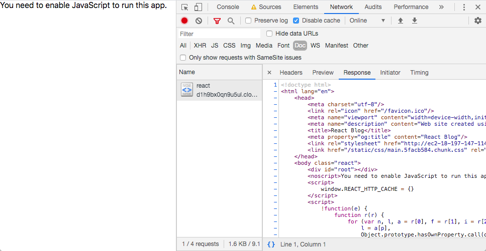
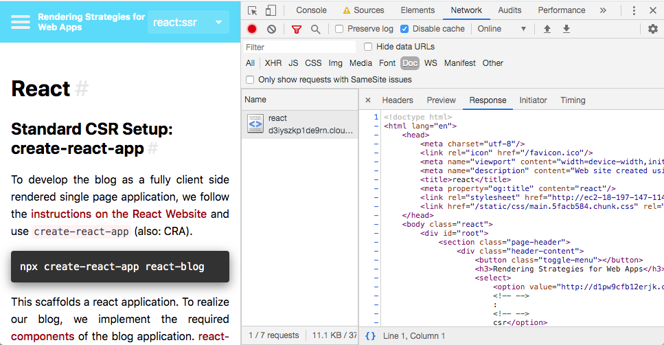
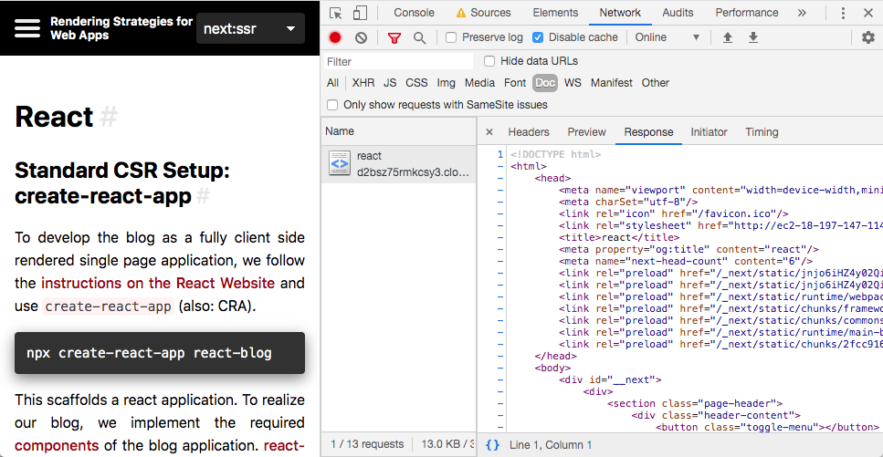

# React

## Standard CSR Setup: create-react-app

To develop the blog as a fully client side rendered single page application, we follow the [instructions on the React Website](https://reactjs.org/docs/create-a-new-react-app.html) and use [`create-react-app`](https://github.com/facebook/create-react-app) (also: CRA).

```shell script
npx create-react-app react-blog
```

This scaffolds a react application. To realize our blog, we implement the required [components](./case-study#frontend) of the blog application.
[react-router](https://github.com/ReactTraining/react-router) is used to realise client side routing.

The application is started by running `npm start` which is mapped to `react-scripts start` and runs a dev server on port `3000`.
If the app is visited with a browser with no JavaScript, the user is presented an empty screen as a result of a content-less HTML file provided by the web server:

<p class="image">

React CSR App visited with JavaScript disabled 
</p>

The source code for this status of development can be assessed [here](https://github.com/glutengo/rendering-strategies/tree/6d477da19d1c339620cbb64c3187ef3d8843540f/react-blog).

### Adding SSR Features

The React API offers functionality to render a React App on a Node.js server. This is part of the standard [react-dom NPM package](https://www.npmjs.com/package/react-dom).
The must straightforward function is `ReactDOMServer.renderToString()` which renders the React app to a string which can be rehydrated once loaded in the browser using `ReactDOM.hydrate()`.<sup>[[1]](#ref-1)</sup>

There is no simple tool which allows us to just add server side rendering to an existing React app created with CRA. 
Instead we need to manually set up a Node.js server which uses the method mentioned above. 
[This post](https://medium.com/bucharestjs/upgrading-a-create-react-app-project-to-a-ssr-code-splitting-setup-9da57df2040a) gives a good overview of the required steps.

If we follow these instructions, we can get to a version of our app which is running on the server. 

On the way, some obstacles were observed:
* The bootstrap file was out of date and had to be updated to use newer versions of @babel/register and its presets.
* Reacts `BrowserRouter` can not be run on the server. 
We need to use `StaticRouter` on the server instead and pass the location from the request, as suggested in the [docs](https://github.com/ReactTraining/react-router/blob/master/packages/react-router-dom/docs/guides/server-rendering.md).
* The client app needs to be built before starting the server and the server app has to be restarted on any change manually. 
The latter can be overcome by using [nodemon](https://www.npmjs.com/package/nodemon) when starting the server.
If we want the client bundle to be rebuilt on any change as well, we can add a separate script for this, as demonstrated [here](https://gist.github.com/int128/e0cdec598c5b3db728ff35758abdbafd).
* Backend data is fetched in the `useEffect` hook in the client app and then added to the component state as suggested in the react docs (TODO: LINK). 
This hook is not run when rendering a react app on the server.<sup>[[2]](#ref-2)</sup> 
The same applies to the `ComponentDidMount` lifecycle method<sup>[[5]](#ref-5)</sup>. 
Instead it is required to prefetch all required data and pass it down to the components.
This can be achieved by using a component property value as the initial value for the `useState` hook in the relevant components. 
This value is passed to the root component (`App`) when rendering on the server. 
The data is fetched from the backend prior to this.
To avoid any duplicated code, the actual fetch call is moved to a util file which is used in the `useEffect` hook in the component and in the server rendering middleware.
To be able to use the same code in both environments, [isomorphic-fetch](https://www.npmjs.com/package/isomorphic-fetch) is used.
* The Header contains a select element which allows to switch between rendering implementations. 
The currently selected method is preselected. 
The function which set this preselection used the location property of the browser-only global `document` variable which resulted in errors when running on the server.
To bypass this problem, a util function was written which returns an object containing the required properties when run on the server by reading these from the express request object instead.

After these issues were resolved, server-side rendering was achieved and the initial HTML payload was content-ful:

<p class="image">

React SSR App visited with JavaScript disabled 
</p>

The required changes can be inspected [here](). Please note that this also includes the needed adjustments for route specific meta data (see below). 

#### Sharing

To improve the sharing performance of our application, we need to set route specific meta tags.
The [create-react-app docs](https://create-react-app.dev/docs/title-and-meta-tags) suggest using [react-helmet](https://www.npmjs.com/package/react-helmet) for this scenario.
This allows us to dynamically set the meta tags (and the other typical `<head>` tags like `<title>`) from within components.
To set the tag contents on the server, the docs advise using a simple replace of a predefined string.

```js
const postId = location.pathname.split('/').pop();

return <section className="page-header">
    <Helmet>
      <title>{postId}</title>
      <meta property="og:title" content={postId}/>
    </Helmet>
    <div className="header-content">
      <button className="toggle-menu" onClick={ () => onClickMenu()}></button>
      <h3>Rendering Strategies for Web Apps</h3>
      <select value={getActiveValue()} onChange={ event => onSelectChanged(event.target.value)}>
        {
          options.map((option, index) =>
            <option key={index} value={option.url}>{option.platform}:{option.technique}</option>
          )
        }
      </select>
    </div>
  </section>
```
 
#### Avoid duplicated requests

The way we set up our components, the data is loaded twice from the backend: Once when rendering on the server and a second time when executing the code on the client.
The second request is not needed. We want our browser to not re-fetch any data which is already given.
To achieve this, we need to initialize our client app with the data already known instead of always performing a http Request.

We store the results of the backend calls performed on the server in a global variable called `REACT_HTTP_CACHE` so it can be accessed in the browser.
When intializing our client app, we read the values of this cache object and pass them to our React app as component properties.
Just like when rendering on the server, our react components now have initial access to our data without performing any further http requests.
Nevertheless, the requests are performed anyways because the `useEffect` hooks run after mounting the component instances.
To avoid this, we add a condition inside the effect handler which checks if the required data is already given.
This is straightforward for the `PostList` and the `Header` as we simply check if the list of content (TOC / rendering options) is empty.
If so, we perform the http call (SSR world); if not, we do not fetch anything.
When it comes to the `Post` component, another condition is required. 
We do not want the component to fetch any data initially because we know the data is already provided by the component props (passed in from the cache).
However we do want the component to fetch the data for another post if the id of the post changes i.e. if the user navigates to another blog post.
To ensure this, we follow the [react docs](https://reactjs.org/docs/hooks-faq.html#how-to-get-the-previous-props-or-state) and compare the current post id to the previous post id and only fetch the post data from the backend if the id has changed.

[This commit](TODO: Link) includes all required changes to avoid any unneeded XHR requests.
 
### Observations
* Adding SSR to a React App which was created with CRA is possible. However, 
there is no strong tooling support. Instead, the setup has to be performed manually.
The documentation gives useful insights and suggestions regarding most of the required steps.
Helpful tutorials from the community are available for support.
* The implemented way of pre-fetching data on the server implies that we know which data to fetch in advance. 
In a larger application with more heterogenous views, it is very likely that this is not always the case. 
In this case, a more generic approach where any http call which is dispatched when a component is mounted is registered and prefetched.
* When using [redux](https://redux.js.org) for state management, more alterations have to be made because of the changed flow of data.
[Their docs](https://redux.js.org/recipes/server-rendering/) provide instructions for this scenario.  
* Our case study assumes that we start by writing a client side rendered single page application and add server side rendering functionality to id.
This is the reason for starting with create-react-app. If server side rendering is a requirement from the beginning, the React docs recommend using [next.js](https://nextjs.org/) instead.<sup>[[3](#ref-3)]</sup>   
      
## Alternative: Next.js

As suggested in the react docs, an alternative to enhancing a react app created with CRA lies in the next.js Framework.

We start by creating a new Next application:

```shell script
npm init next-app
``` 

In contrast to the React application created above, next.js applications are structured a bit differently regarding routing.
In a CRA app we typically have one root component where we include static elements (in our case: the header and the menu containing the post list) and a placeholder for the actual page content which is filled by the router.
In a next.js app, each page has an own file, so there is no root component. 
To still be able to have static elements which appear on each of these pages and not repeat too much code, the [next.js guide](https://nextjs.org/learn/basics/using-shared-components) suggests setting them up as shared components and putting them into a higher order `Layout` component.
This Layout component is then included in each page whilst the actual page content is put inside this component. 

```js
const Post = props => (
  <Layout { ...props.layoutProps } >
    <Head>
      <title>{props.id}</title>
      <meta property="og:title" content={props.id}/>
    </Head>
    <div className="post" dangerouslySetInnerHTML={{__html: props.content}}></div>
  </Layout>
);
```

```js
export const Layout = props => (
  <div>
    <Head>
      <link rel="icon" href="/favicon.ico"/>
      <link rel="stylesheet" href="http://localhost:8082/style.css"/>
    </Head>
    <Header {...props.header}/>
    <section className="page-menu" onClick={() => onClickMenu()}>
      <PostList {...props.postList}/>
    </section>
    <section className="page-content">
      {props.children}
    </section>
  </div>
);
```

This pattern also gives us the ability set the meta tags for sharing in a very declarative way.  

#### Avoid duplicated requests

As we are still using the react library, our components look almost the same as in our react app created with CRA.
The main difference is that instead of using the `useEffect()` hook, we add a static method called `getInitialProps()` to fetch the required data.
If a component has this static method and the component is used as a page, it is called by the next framework when it is mounted into the application.
The method is called on the server if the concerned page is the initially requested page and it is called on the client if the page is displayed after performing a navigation in the browser.
Given this knowledge, it is important to not use browser-only features here. Therefore, we use `isomorphic-fetch` for getting any data from the backend.<sup>[[4]](#ref-4)</sup>

Thanks to `getInitialProps`, we have complete server side rendering out of the box and there are no duplicated requests for the initial page.
To keep the code clear, we would however not want our page component to be responsible for getting the data for each child component used in the page.
The Post page should not need to know which data the header or the menu needs to load.
To achieve this, we also create a static `getInitialProps` on each of the child components. 
This concerns the `Layout` component, the `Header` component and the `PostList` component, whilst the latter two only occur as a child of the first.
Therefore, the `getInitialProps` function for `Header` and `PostList` fetch their respective data.
The `getInitialProps` function for `Layout` just calls the `getInitialProps` functions of its two child components and passes the results as properties to them.
This step is required, because next.js only calls `getInitialProps` for pages and not for its child components.<sup>[[4]](#ref-4)</sup>

```js
PostList.getInitialProps = async function(context) {
  return { posts: await useCache(`${getBaseURL(context)}/posts/toc.json`, 'posts') };
};
``` 
 
```js
Layout.getInitialProps = async function(context) {
  return {
    postList: await PostList.getInitialProps(context),
    header: await Header.getInitialProps(context)
  };
};
```

Our page component follows a similar pattern: It fetches the data it needs itself (in case of our Post page: the content of the post) and it calls the static `getInitialProps` function of the `Layout` component and passes down the data.
  
```js
Post.getInitialProps = async function(context) {
  const content = await (await fetch(`http://localhost:8082/post/${context.query.id}`)).text();
  return {
    layoutProps: await Layout.getInitialProps(context),
    content,
    id: context.query.id
  };
};
```

The context object passed to `getInitialProps` contains routing information as the pathname and query params as well as the request and response object (server only).<sup>[[4]](#ref-4)</sup>
To be able to access this information in the child components, we always pass this object on when `getInitialProps` is called.

The source code of this version of the application is available [here](https://github.com/glutengo/rendering-strategies/tree/eab7799e084a8eda767b219ef7208c427489b8c0/next-blog).

As mentioned earlier, we don't have duplicated requests for the initial page load. 
However if we navigate to another blog post, not only the content of the post is fetched but also the required data for the header and the menu.
This is the case because of the next.js architecture which give [pages](https://nextjs.org/docs/basic-features/pages) a central meaning.
The `Header` and `PostList` component are not reused when the route is changed. 
Instead, they are re-created and as we are on the client, their `getInitialProps` functions are called on every page load.
Their content does not change, so we could easily cache this data.

```js
export function withCache(props) {
  if (process.browser) {
    window.NEXT_HTTP_CACHE = {
      ...window.NEXT_HTTP_CACHE,
      ...props
    };
  }
  return props;
}

export async function useCache(url, propertyName) {
  let data;
  if (process.browser && window.NEXT_HTTP_CACHE) {
    data = window.NEXT_HTTP_CACHE[propertyName];
  }
  if (!data) {
    data = await (await fetch(url)).json();
  }
  return data;
}
```

To achieve this, we create a simple cache which creates a global object called `NEXT_HTTP_CACHE`.
When a component is rendered which needs to read or write from the data, it uses the `withCache` function and passes in the concerned props.
For example when the PostList is rendered, it already knows its initialProps because they were pre-fetched on the server.
At this point, we store this initial data in our cache object.
In the `getInitialProps` function, we do not perform `fetch` calls anymore. 
Instead, we pass the requested URL and the cache key (`propertyName`) to the `useCache` function.
This checks if the requested key exists in the cache and responds with its data our performs the actual fetch call otherwise.

With the http cache added, there are no more duplicated requests, neither for the initial page load, nor for any further navigation. 
The changes required to add the http cache are summarized in [this commit](https://github.com/glutengo/rendering-strategies/commit/43767a2d9d598aa298ffc544a510352108c1129c).

<p class="image">

Next App visited with JavaScript disabled 
</p>


<a name="ref-1">[1]</a> [React docs: ReactDOMServer](https://reactjs.org/docs/react-dom-server.html)  
<a name="ref-2">[2]</a> [React Developer Brian Vaughn on Twitter](https://twitter.com/brian_d_vaughn/status/1055590462122156033?lang=en)  
<a name="ref-3">[3]</a> [React docs: Recommended Toolchains](https://reactjs.org/docs/create-a-new-react-app.html#recommended-toolchains)  
<a name="ref-4">[4]</a> [Next.js docs: getInitialProps](https://nextjs.org/docs/api-reference/data-fetching/getInitialProps)  
<a name="ref-5">[5]</a> This can be validated for instance by adding a simple `console.log` statement in the `componentDidMount` lifecycle function of a component and then rendering it on the server.      
