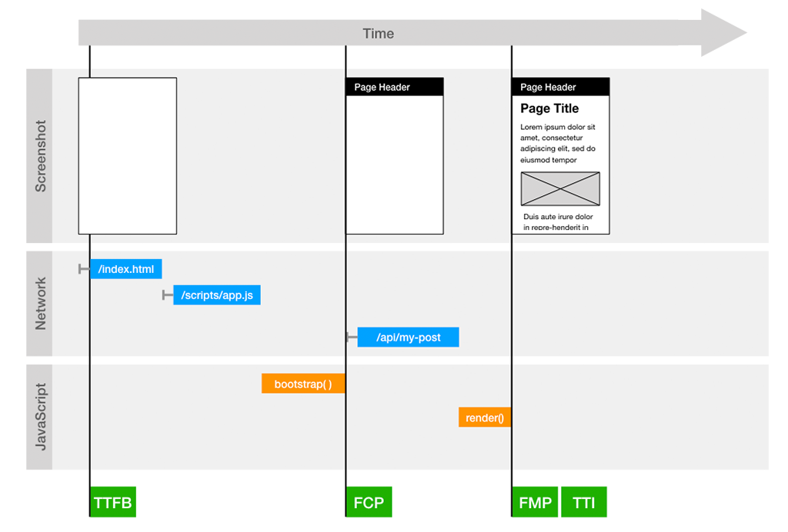

# Rendering Strategies

[We have seen](./motivation) that Single Page Applications built with modern web frameworks are very popular.
It is also known that these single page applications have potential flaws regarding perceived user performance and search engines.

To tackle these flaws it is required to put the rendering strategy which is used in single page applications into perspective.

## Client Side Rendering (CSR)

In their standard setups, Angular, React and Vue all use a rendering strategy which is described as Client Side Rendering (CSR).

> "Client-side rendering (CSR) means rendering pages directly in the browser using JavaScript. All logic, data fetching, templating and routing are handled on the client rather than the server." [[1]](#ref-1)

This means that the initial HTML document provided by the server does not contain any content.

Typical timeline for the rendering process for CSR<a href="#ref-2">[2]</a>  

Our application needs to load and process further resources (primarily JavaScript) to be able to display the content and allow any interaction.
For client side rendered applications, the TTFB is usually very low because the server only needs to deliver static resouces.
However, the FMP and the TTI are usually quite high which can lead to a bad perceived performance regarding page load. 
Once the application is fully loaded, it feels very quick and does not need full repaints when navigating to other areas of the application because the logic to render the UI has already been downloaded and the newly needed data can be fetched asynchronously. 

## Server Side Rendering (SSR)

The complete opposite of CSR lies in Server Side Rendering (SSR).
  
> "Server rendering generates the full HTML for a page on the server in response to navigation. This avoids additional round-trips for data fetching and templating on the client, since it’s handled before the browser gets a response." [[1]](#ref-1)

In this case, the initial HTML document contains the actual content of the page.

Typical timeline for the rendering process for SSR<a href="#ref-2">[2]</a>  

The application may load and process JavaScript to add enhancements, but these scripts tend to be a lot smaller because they are not responsible for critical tasks like rendering.
Because the HTML needs to be built on the server and more data is transferred from the server to the client in the initial request, the TTFB is usually higher compared to CSR applications.
This can be improved by adding a cache so the HTML does not need to be re-created on every Request. 
However, the payload size will remain a relevant factor.
On the other side, the gap between TTI and FMP is smaller because the amount of JavaScript that needs to be processed is smaller in most cases.
The user experience is considered worse because navigation to another (sub) page requires a full repaint of the page.

## SSR with with re-hydration

Comparing the two techniques, it seems useful to find a solution which combines the best of the two:
Having a fully rendered DOM in the initial Request and not needing a page reload when navigating through the application.

To achieve that, we need to to render the initially requested page on the server and still bootstrap the full application in the browser again.
If we would just do that and let our single page application clean the DOM Element where it uses as a rendering target, we would end up with a temporarily blank screen.
To avoid that, a technique called *hydration* or *re-hydration* has emerged.

> "Rehydration: “booting up” JavaScript views on the client such that they reuse the server-rendered HTML’s DOM tree and data." [[1]](#ref-1) 
 
Just like the CSR approach, this solution provides a good user experience in terms of not needing any full page reloads, once the application is fully loaded.

Typical timeline for the rendering process for SSR with ry-hydration<a href="#ref-2">[2]</a>

It is slower regarding TTFB because the server needs to do more than just deliver static files and the payload of the initial request is bigger.
Again, this can be significantly improved by adding a cache.
The FMP should be comparably low or at least the difference between FMP and TTFB should be small because our single page application does not need to do any rendering or fetch data before the user is presented with the content.
Probably the biggest downside of this approach is an increased gap between FMP and TTI.
The user may be presented the contents very quickly but he still needs to wait until the JavaScript is processed until the application becomes fully reactive.    
  

  
  
<a name="ref-1">[1]</a> [developers.gooole.com: Rendering on the web](https://developers.google.com/web/updates/2019/02/rendering-on-the-web)  
<a name="ref-2">[2]</a> These diagrams were created based on the insights gained in the [measurements results](./results) of the [case study](./case-study) and inspired by [[1]](#ref-1) and the [performance tab](https://developers.google.com/web/tools/chrome-devtools/evaluate-performance) in Chrome developer tools.  
