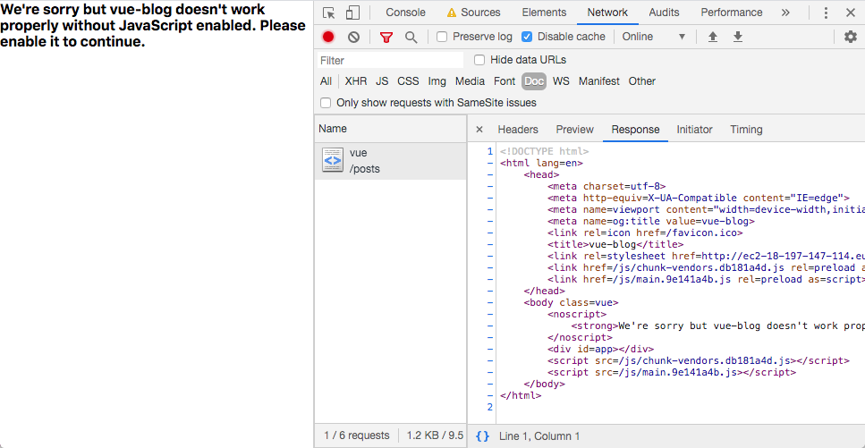
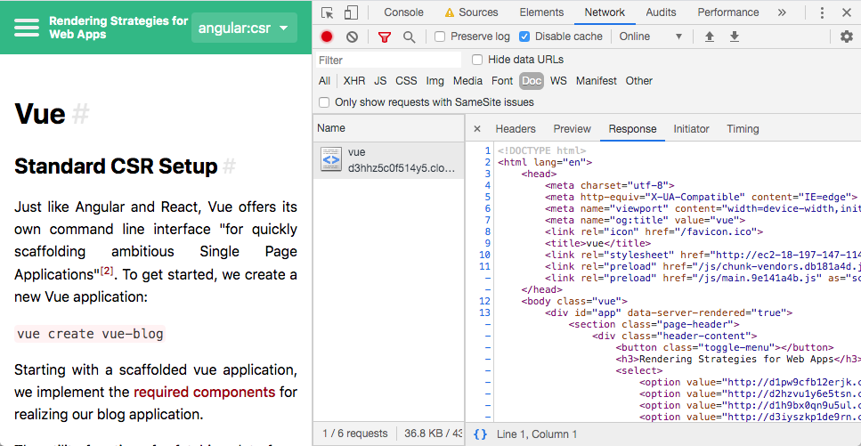

# Vue.js

## Standard CSR Setup

Just like Angular and React, Vue.js offers its own command line interface "for quickly scaffolding ambitious Single Page Applications" <sup>[[2]](#ref-2)</sup>.
To get started, we create a new Vue application:

```shell
vue create vue-blog
```

Starting with a scaffolded Vue.js application, we implement the [required components](./case-study#frontend) for realizing our blog application.

The utility functions for fetching data from the server are identical to those that we use in react.
We also use [isomorphic-fetch](https://www.npmjs.com/package/isomorphic-fetch) here to be compatible with both environments (client / server).

To start the application, we run `npm run serve` which is mapped uses `vue-cli-service serve` to run a dev server on port `8080`.

As we are only rendering our application in the browser, our initial DOM is empty.
Without JavaScript enabled in the browser, we will not be presented any relevant data.

<p class="image">

Vue CSR App visited with JavaScript disabled 
</p>

The source code for this status of development can be assessed [here](https://github.com/glutengo/rendering-strategies/tree/1daef909ad3d04c70d00f3793bea7b10a496021f/vue-blog).

## Adding SSR Features

Vue provides a very detailed [guide on SSR](https://ssr.vuejs.org/) implementation.
We will use this guide when we attempt to render our application on the server.

To get started, we need to install the `vue-server-renderer` package from NPM.
We will also need `express` to handle our http requests.

```shell script
npm install vue-server-renderer express --save
```

We then create a server script (`server.js`) where we set up a route and call our renderer.
As suggested in the guide, we also clone our `index.html` file and make some adjustments so it can be used as a template for vue-server-renderer.

```html
<!DOCTYPE html>
<html lang="en">
  <head>
    <meta charset="utf-8">
    <meta http-equiv="X-UA-Compatible" content="IE=edge">
    <meta name="viewport" content="width=device-width,initial-scale=1.0">
    <meta name="og:title" value="{{title}}">
    <link rel="icon" href="<%= BASE_URL %>favicon.ico">
    <title>{{title}}</title>
    <link rel="stylesheet" href="http://localhost:8082/style.css">
  </head>
  <body>
    <!--vue-ssr-outlet-->
  </body>
</html>
```

We also have to make a few adjustments to the build process which was set up for us by Vue.js CLI.
* The creation of our vue app was formerly handled in our `main.js` entrypoint file for client side rendering.
Now that we need two entrypoints, the creation of the app is wrapped in a function and moved to a `app.js` file.
We then add `entry-client.js` and `entry-server.js` which uses this function and adds the steps required for the respective platform: `app.$mount()` for browser rendering and a utility function which handles initializing the router with the correct URL and can be used in `createBundleRenderer`.
The latter is a feature of `vue-server-renderer` which adds support for productivity enhancements like source maps and hot-reload<sup>[[4]](#ref-4)</sup>.
* A `vue.config.js` file was added. This is a configuration file which will be loaded by the CLI and is used to override parts of the default configuration.
We add a minimal client configuration and a configuration for server side rendering so we can build either version using an environment variable.
* The server script imports the built bundles and uses `bundleRenderer` to render the relevant page and provide the client bundle.

In our initial implementation, the data for our components (e.g. the current blog post in the `Post` component) were loaded in the `mounted` vue lifecycle method.
This method is not called when our app is rendered on the server.<sup>[[5]](#ref-5)</sup>
Instead, we are provided with an alternative lifecycle method which is only executed on the server: `serverPrefetch()`<sup>[[5]](#ref-5)</sup>
So to make sure that our data is fetched in both scenarios, we call our `fetchData` method in lifecycle methods.

```javascript
export default {
    name: 'Post',
    data() {
      return {
        content: getPostFromCache(this.$route.params.id)
      }
    },
    mounted() {
      this.fetchData(this.$route.params.id);
    },
    async serverPrefetch() {
      await this.fetchData(this.$route.params.id);
    },
}
```

[With these adjustments](https://github.com/glutengo/rendering-strategies/commit/dfcae0ff42b96c034dbeb3e86c055122bd010783), our application is ready to be used with sever side rendering.

<p class="image">

Vue SSR App visited with JavaScript disabled 
</p>

### Avoid duplicated requests

When adding server side rendering, we did make sure that our application was always able to display all data with minimal adjustments to the code.
However our application is performing some unneeded requests because it re-fetches data which was already given in the DOM before our client application was mounted.
So we have three unneeded XHR requests performed by our browser application: The data for the current post, the list of rendering options and the post list.
All of this data is already given when we load the initial document from the server, so we want to get rid of these redundant requests.

The Vue SSR Guide suggests using the state management library [Vuex](https://github.com/vuejs/vuex) in this scenario<sup>[[5]](#ref-5)</sup>.
This would require setting up a data store and rethinking the data flow of our application.
We did not introduce any state management library when working with Angular and React.
To keep things consistent and minimize dependencies, we will therefore not use Vuex here either.

Instead, we introduce a simple http cache which collects all http calls which were performed by the server.
We include this object in the response for the initial request and make sure that the client application consults the cache before performing an actual request.
Thanks to the distinct lifecycle methods which were used on server and client, the changes could be made without touching the components code.
Instead, only the util function for fetching the data needed major adjustments, as you can see [here](https://github.com/glutengo/rendering-strategies/commit/c8d8fec1c4b3b798552cd850f758d9afc6b6cb6c).


### Sharing

As Vue.js does not offer an official way of updating meta information like the document title or `og:` meta tags<sup>[[2]](#ref-2)</sup>, we manually set these through DOM manipulation:

```javascript
function setMeta(title) {
  document.title = title;
  document.head.querySelector('meta[name="og:title"]').setAttribute('value', title);
}
```

This function is called whenever the current blog post changes.
When run on the server, this would result in an error, because the `document` variable is unknown.
To get rid of the error, we check if we are in the browser environment before accesses the variable.

To ensure that the tags are also set when rendering on the server, we adjust our template html file.
While the the values for the `<title>` and `og:title` `<meta>` tag for the client are filled by webpack, we can use the vue-server-render context for this purpose instead.
We simply need to set the `title` attribute of the context and reference this attribute in our template:

```html
<head>
  <!-- ... -->
  <meta name="og:title" value="{{ title }}">
  <title>{{ title }}</title>
  <!-- ... -->
</head>
```   

### Observations
* Vue provides a detailed guide on how to add server side rendering to an existing Vue.js app created with the Vue.js CLI. The steps had to be performed manually.
* Avoiding duplicated requests without Vuex required some manual implementation
* Setting the sharing tags required manual implementation and handling the different platforms (server / browser) the code runs on 
* The changes needed for the SSR setup require a solid knowledge of webpack and the vue build process.
The docs mention [nuxt.js](https://nuxtjs.org/) as an alternative for new projects or developer teams with limited knowledge in these areas<sup>[[6]](#ref-6)</sup>. 

<hr/>

<a name="ref-1">[1]</a> [vuejs.org. Installation: CLI, visited March 2nd 2020](https://vuejs.org/v2/guide/installation.html#CLI)  
<a name="ref-2">[2]</a> [Blake Newman on github.com. Official way to modify page metadata/title/etc.](https://github.com/vuejs/vue/issues/4379#issuecomment-266907339)  
<a name="ref-3">[3]</a> [cli.vuejs.org. Configuration Reference: vue.config.js](https://cli.vuejs.org/config/#vue-config-js)  
<a name="ref-4">[4]</a> [ssr.vuejs.org. Introducing BundleRenderer](https://ssr.vuejs.org/guide/bundle-renderer.html)  
<a name="ref-5">[5]</a> [ssr.vuejs.org. Data Pre-Fetching and State](https://ssr.vuejs.org/guide/data.html)  
<a name="ref-6">[6]</a> [ssr.vuejs.org. Server Side Rendering](https://vuejs.org/v2/guide/ssr.html)  
